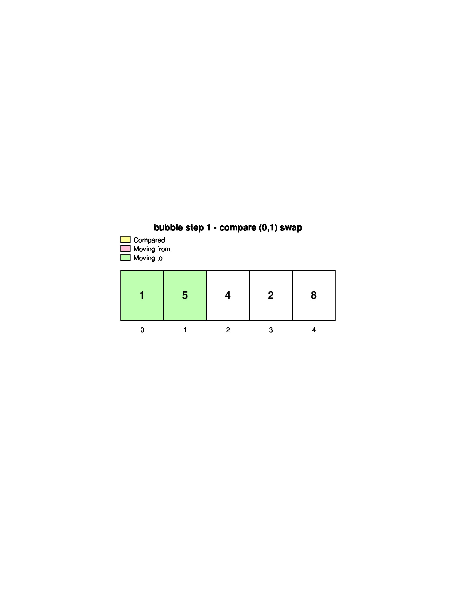
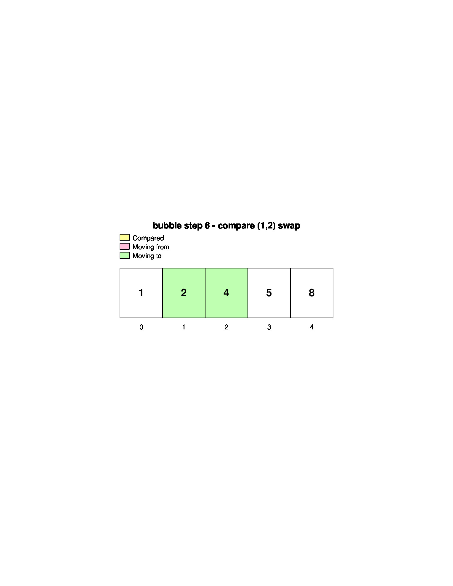
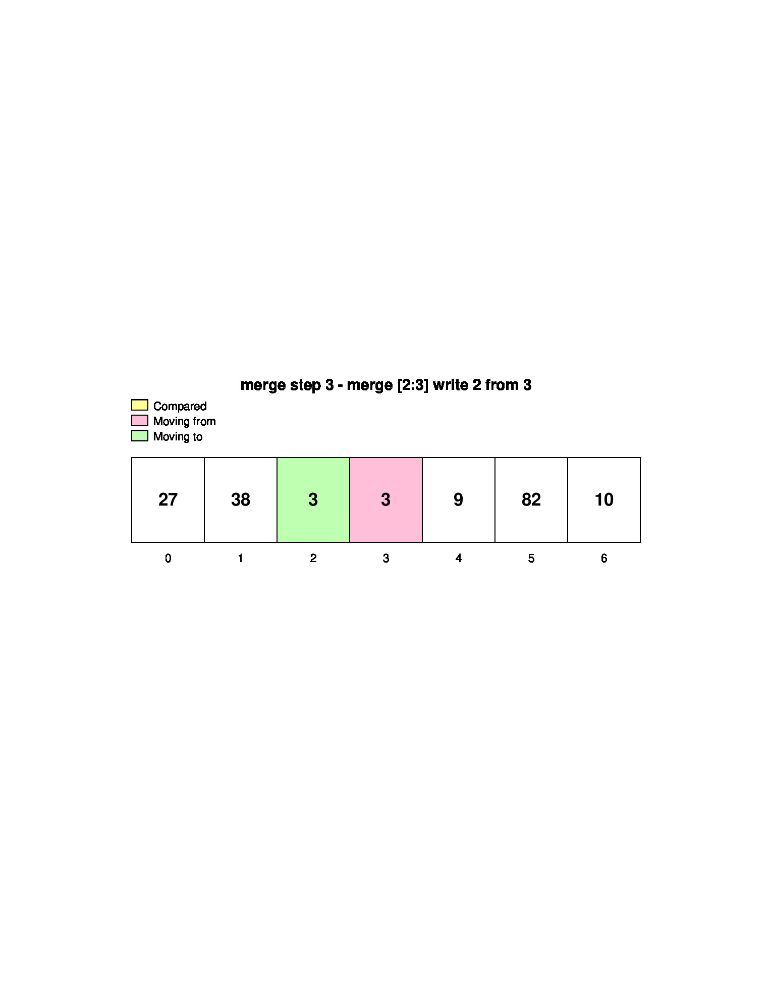
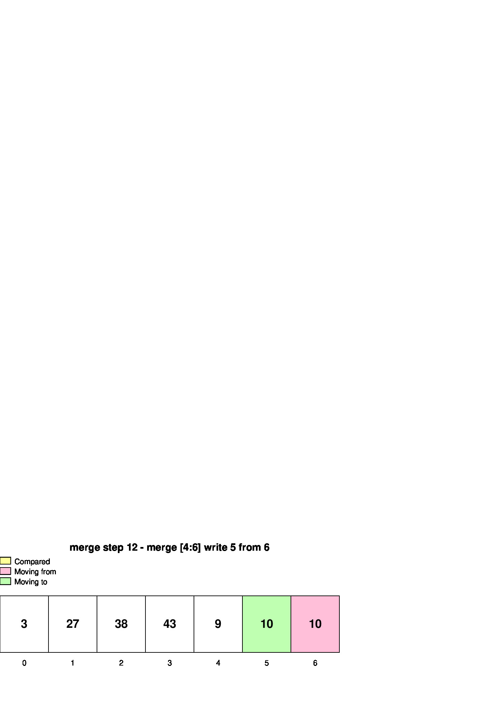
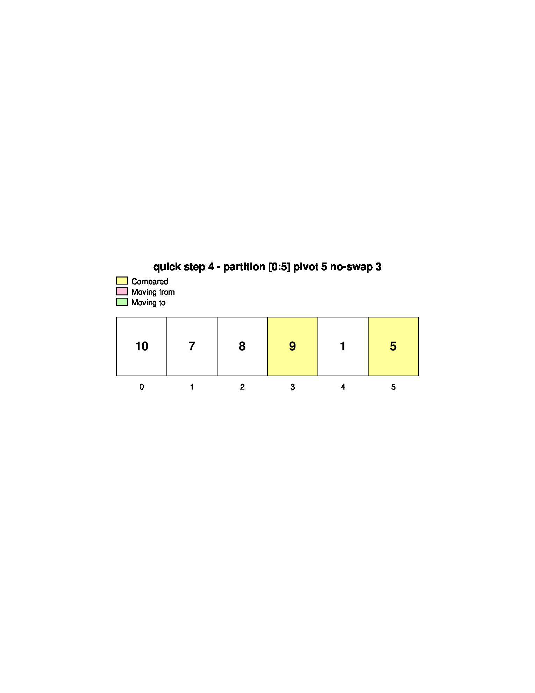
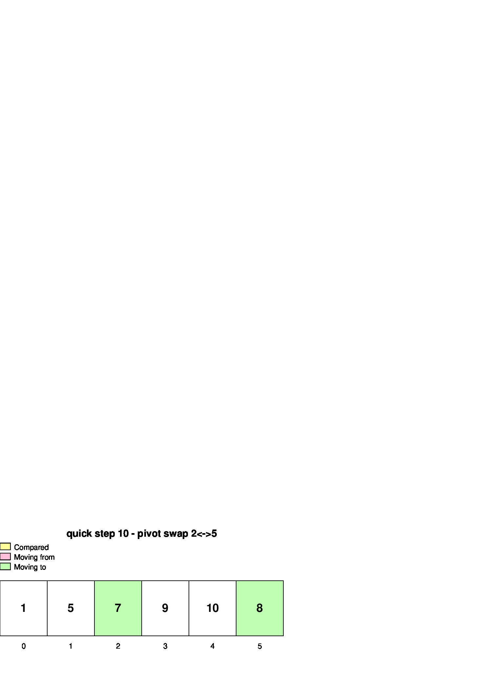

# Sorting Visualizer (sortviz)

This project generates step-by-step sorting visualizations as `jgraph` files, then converts them to PostScript and PDF.

Supported algorithms:

- `bubble`
- `merge`
- `quick`

Each step is rendered as a row of indexed squares (inspired by `tests/square.jgr`) with highlight colors:

- **Yellow**: compared indices
- **Pink**: value moving from this index
- **Green**: value moving to this index

## Compilation and demo output

Build and generate demo outputs (PDF + JPG) with one command:

```bash
make
```

This compiles `sortviz` (if needed), runs several sorting scenarios, and writes showcase files to:

- `tests/demo/*.pdf`
- `docs/images/*.jpg`

## Compile only

```bash
make build
```

## Program usage

```bash
./sortviz <bubble|merge|quick> <values...>
```

Examples:

```bash
./sortviz bubble 5 1 4 2 8
./sortviz merge 38,27,43,3,9,82,10
./sortviz quick 10 7 8 9 1 5
```

Each run creates a timestamped folder under `tests/bin/` containing one file per step in all formats:

- `step_XXXX.jgr`
- `step_XXXX.ps`
- `step_XXXX.pdf`

## Example pictures

### Bubble sort




### Merge sort




### Quick sort



